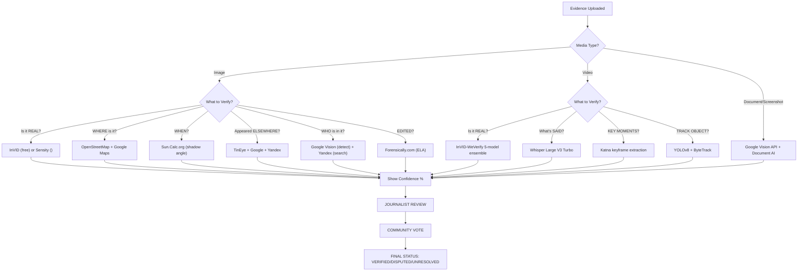

# Visual Verification Tools - Decision Matrix
## Quick Reference for Project Truth

---

## DECISION TREE: Which Tool to Use When?

```
User uploads visual media
    ↓
    ├─ Is it an IMAGE?
    │   ├─ Need to check if REAL or DEEPFAKE?
    │   │   ├─ InVID-WeVerify (free, decent)
    │   │   └─ Sensity AI (expensive, enterprise)
    │   ├─ Need to find WHERE it was taken?
    │   │   ├─ Bellingcat OpenStreetMap + Google Maps
    │   │   └─ Sun.Calc.org (shadow analysis)
    │   ├─ Need to verify if EDITED?
    │   │   ├─ Forensically.com (ELA, fast)
    │   │   └─ ExifTool (metadata check)
    │   ├─ Need to check if it appeared ELSEWHERE online?
    │   │   ├─ TinEye (best for origins)
    │   │   ├─ Google Lens (largest index)
    │   │   └─ Yandex (best for faces)
    │   └─ Need to IDENTIFY A PERSON?
    │       ├─ Google Vision (detect only, no identification)
    │       └─ Yandex + PimEyes (face search)
    │
    ├─ Is it a VIDEO?
    │   ├─ Need VIDEO DEEPFAKE detection?
    │   │   ├─ InVID-WeVerify plugin (5-model ensemble)
    │   │   └─ TrueMedia / Sensity (enterprise)
    │   ├─ Need TRANSCRIPT of speech?
    │   │   ├─ Whisper Large V3 Turbo (local, free, 98%+ accurate)
    │   │   └─ Voxtral (faster, proprietary)
    │   ├─ Need to find KEY MOMENTS?
    │   │   ├─ Katna (ML keyframe extraction)
    │   │   └─ FFmpeg (basic scene cuts)
    │   └─ Need to TRACK an OBJECT?
    │       ├─ YOLOv8 (real-time detection + tracking)
    │       └─ ByteTrack (lightweight, robust)
    │
    ├─ Is it a PDF or DOCUMENT?
    │   └─ Extract TEXT + STRUCTURE
    │       ├─ Google Document AI (your GCP — use this)
    │       └─ Tesseract (open source backup)
    │
    └─ Is it a SCREENSHOT or PHOTO OF TEXT?
        └─ Extract TEXT
            ├─ Google Vision API (your GCP — use this)
            └─ Tesseract (open source backup)
```

---

## TOOL COMPARISON MATRIX

### Image Forensics

| Tool | Purpose | Accuracy | Cost | Speed | Integration | Recommendation |
|------|---------|----------|------|-------|-------------|----------------|
| **ExifTool** | Metadata extraction | 100% | Free | <1s | CLI/batch | ✅ MVP |
| **Forensically.com** | ELA + noise + clone | 85% | Free | <5s | Browser | ✅ MVP |
| **FotoForensics** | Quick ELA check | 80% | Free | <5s | Browser | ✅ MVP |
| **Amped Authenticate** | Professional forensics | 95% | $5K-15K/yr | <10s | Desktop+API | 🟡 High stakes only |
| **InVID plugin** | Multi-tool verification | 80% | Free | Variable | Chrome ext | ✅ MVP |

### Deepfake Detection

| Tool | Video/Image | Accuracy | Cost | Real-time | Integration | Recommendation |
|------|-------------|----------|------|-----------|-------------|----------------|
| **InVID-WeVerify** | Video (5-model ensemble) | 85-90% | Free | No | API | ✅ MVP |
| **Sensity AI** | Both | 95%+ | $10K-50K/yr | Yes | API | 🟡 Enterprise |
| **TrueMedia** | Both | 90%+ | Enterprise | Yes | API | 🟡 Enterprise |
| **C2PA Standard** | Provenance check | Cryptographic | Free | Yes | SDK | ✅ Future |

### Speech-to-Text & Audio

| Tool | Accuracy | Multilingual | Speed | Cost | Speaker ID | Recommendation |
|------|----------|--------------|-------|------|------------|----------------|
| **Whisper Large V3 Turbo** | 98% | 99 languages | 5.4x faster | Free | No | ✅ MVP |
| **WhisperX** | 98% + word timing | All Whisper langs | Slower | Free | Yes | ✅ MVP (add later) |
| **Voxtral** | 99%+ | All major languages | Faster | Proprietary | Optional | 🟡 Future |
| **DeepSpeech** | 85-90% | DEPRECATED | Fast | Free | No | ❌ Don't use |

### Key Frame Extraction

| Tool | Method | Accuracy | Cost | Integration | Recommendation |
|------|--------|----------|------|-------------|----------------|
| **Katna** | ML-based semantic | 85% | Free | Python library | ✅ MVP |
| **video-keyframe-detector** | Frame difference | 75% | Free | Python CLI | ✅ Backup |
| **FFmpeg** | Scene cut detection | 70% | Free | CLI | ✅ Simple videos |

### Object Tracking

| Tool | Purpose | FPS | Accuracy | Cost | Recommendation |
|------|---------|-----|----------|------|----------------|
| **YOLOv8** | Real-time detection + tracking | 80+ FPS | 95%+ | Free | ✅ MVP |
| **ByteTrack** | Lightweight MOT | 60+ FPS | 90% | Free | ✅ Fallback |
| **DeepSORT** | Appearance-based tracking | 30 FPS | 88% | Free | 🟡 Overkill |

### Reverse Image Search

| Tool | Strength | Weakness | Cost | Integration | Recommendation |
|------|----------|----------|------|-------------|----------------|
| **TinEye** | Finding ORIGINS + modifications | Not largest index | $200-500/mo | API | ✅ Best for origins |
| **Google Lens** | Largest index | Less depth on origins | Free (10K/month quota) | API | ✅ Primary |
| **Yandex** | Face recognition | Smaller index | Free | No official API | ✅ For faces |
| **PimEyes** | Face search + privacy-focused | Expensive | $30-100/search | Web only | 🟡 High value faces |

### Geolocation

| Tool | Purpose | Accuracy | Cost | Integration | Recommendation |
|------|---------|----------|------|-------------|----------------|
| **OpenStreetMap** | Landmark search | Variable | Free | Web | ✅ MVP |
| **Google Maps/Street View** | Street-level verification | High | Free | Web | ✅ MVP |
| **Sun.Calc.org** | Shadow analysis (when) | 95% | Free | Web | ✅ MVP |
| **ShadowTrack** | Auto shadow analysis | 90% | Proprietary | Web | 🟡 Nice-to-have |
| **Bellingcat's toolkit** | Integrated OSINT | Variable | Free | Web resources | ✅ Methodology |

---

## MVP vs NICE-TO-HAVE vs FUTURE

### MVP (Launch with these)
```
[ Sprint 1 ]
✅ Vision API (object detection, labels, faces)
✅ ExifTool (metadata)
✅ Google Lens (reverse image search)
✅ Whisper (transcription)
✅ Forensically.com (ELA)
✅ Community voting system
✅ Reputation scoring

[ Sprint 2 ]
✅ Katna (keyframes)
✅ YOLOv8 (object tracking)
✅ Bellingcat geolocation hints
✅ TinEye integration
```

### Nice-to-Have (Build if budget allows)
```
🟡 InVID-WeVerify API deepfake detection
🟡 WhisperX speaker diarization
🟡 Yandex face search
🟡 Professional deepfake tools (Sensity)
🟡 Amped Authenticate
```

### Future (Post-launch)
```
⏳ C2PA content authentication standard
⏳ IPFS for immutable evidence storage
⏳ Blockchain timestamps
⏳ Automated geolocation (computer vision)
⏳ Real-time deepfake detection
```

---

## COST BREAKDOWN (ESTIMATED)

### LAUNCH BUDGET (MVP)

```
ONE-TIME:
  Vision API setup           $0 (GCP credit)
  Document AI setup          $0 (GCP credit)
  ExifTool (open source)     $0
  Whisper setup              $0
  Katna/YOLO setup           $0
  ────────────────────────────────
  Total one-time:            $0 (if you use GCP credits)

MONTHLY:
  Google Vision API          $0-30 (10K requests free)
  Google Document AI         $0-5 (5K pages free)
  Google Cloud Storage       $15-50 (video hosting)
  TinEye API (per search)    $0.05 × 200 = $10/month
  Supabase (compute)         $50-200
  Whisper (local)            $0
  ────────────────────────────────
  Total monthly:             $75-285

ANNUAL:
  Total launch year:         $900-3420
```

### SCALE-UP BUDGET (Add enterprise tools)

```
MONTHLY (after launch):
  Sensity AI deepfake        +$500-2000
  Amped Authenticate         +$400-1250
  TrueMedia                  +$500-1500
  Professional support       +$1000
  ────────────────────────────────
  Total monthly:             ~$3000-5000
```

**Why stay lean at launch?**
- Journalists vote on AI results, so imperfect tools are OK
- You own the final verdict, not the AI
- Easy to upgrade tools later without changing architecture
- GCP $300 credit covers months of operation

---

## PRIVACY & COMPLIANCE CHECKLIST

### For Launch

- [ ] Face detection (Vision API) — only detects, never identifies
- [ ] Auto-blur bystander faces in photos
- [ ] Warn users before extracting GPS
- [ ] Option to strip EXIF before upload
- [ ] Data retention policy (auto-delete after 90 days?)
- [ ] GDPR Data Protection Impact Assessment drafted
- [ ] Privacy policy updated (facial data processing)
- [ ] User consent for forensic analysis
- [ ] Audit log for all forensic reviews

### Before Processing High-Value Evidence

- [ ] Legal review (journalist shield laws in your jurisdiction)
- [ ] Ethical review (face detection on minors? — NO)
- [ ] Source verification (is this a legitimate journalistic investigation?)
- [ ] Conflict of interest check (is this a personal vendetta?)

---

## QUALITY GATES (When to Trust AI)

### ✅ Safe to Use Without Human Review

```
ELA shows editing (no judgment, just detection)
  → Show journalist "edited regions at coordinates X,Y"
  → Journalist decides if suspicious or legit

Vision API detects objects (no judgment)
  → "AI sees: 5 people, 2 vehicles, 1 building"
  → Journalist verifies matches context

Metadata warnings (informational only)
  → "GPS location embedded: [coordinates]"
  → Journalist decides if relevant

Transcript exists (confidence-weighted)
  → Show with confidence scores per segment
  → Journalist corrects speech-to-text errors
```

### ⚠️ Requires Expert Review (Tier 2+)

```
Deepfake score >60% OR <40%
  → Show model breakdown (5 models, not consensus)
  → 2 independent experts must agree

Reverse image search shows misattribution
  → Show first appearance date + other instances
  → Journalist verifies source claim

Geolocation candidates (multiple hits)
  → Show all possibilities with confidence
  → Journalist picks most likely + verifies street view
```

### ❌ Never Trust (Always Human Decision)

```
Face identification (InVID doesn't do this anyway)
Verdict on guilt or innocence
Determination of legality
Permission to publish
Attribution of wrongdoing
```

---

## TESTING CHECKLIST

Before shipping each feature:

```
[ ] Test with HIGH-QUALITY evidence (real court documents, verified news)
[ ] Test with MANIPULATED evidence (edited photos, deepfakes)
[ ] Test with AMBIGUOUS evidence (low quality, unknown origin)
[ ] Test with ADVERSARIAL evidence (attempt to fool detectors)

[ ] Accuracy rate >85% on test set
[ ] False positive rate <10% (don't flag real as fake)
[ ] False negative rate <5% (catch actual fakes)
[ ] Response time <30s for basic analysis
[ ] Response time <2min for video analysis
[ ] No crashes on edge cases (corrupted files, unusual formats)

[ ] Journalist usability test (can they use it intuitively?)
[ ] Privacy test (no data leaks, proper redaction)
[ ] Performance test (doesn't slow down main app)
[ ] Mobile test (works on low-bandwidth connections)
```

---

## DECISION FLOWCHART FOR "WHEN TO USE WHICH TOOL"



---

## ONE-PAGER: HOW TO PRESENT TO JOURNALISTS

**Subject: What This Forensics System Does (And Doesn't)**

**What AI Helps With:**
- Extracts metadata (camera, timestamp, location)
- Flags potential editing via compression analysis
- Finds where image appeared first online
- Transcribes video audio (98% accurate)
- Detects objects and scenes
- Identifies synthetic media patterns

**What AI Cannot Do (And Humans Must Decide):**
- Prove someone is innocent or guilty
- Determine if evidence is admissible in court
- Tell you the "truth"
- Recommend publication

**Your Job as Journalist:**
1. Review AI signals
2. Apply context (do signals match your investigation?)
3. Verify independently (street view, phone records, etc.)
4. Publish with confidence

**Community's Job:**
- Review your work
- Spot blind spots
- Vote on accuracy
- Build reputation for honest reviews

**Bottom Line:**
AI is 85% accurate. You are the final editor. Community keeps us honest.

---

## FINAL RECOMMENDATION FOR PROJECT TRUTH

```
PHASE 1 (Weeks 1-4): Foundational Tools
├─ Vision API (labels, objects, faces)
├─ ExifTool (metadata)
├─ Forensically (ELA)
├─ Google Lens (reverse search)
├─ Whisper (transcription)
└─ Community voting

PHASE 2 (Weeks 5-8): Enhanced Verification
├─ TinEye API (origins)
├─ Katna (keyframes)
├─ YOLOv8 (tracking)
├─ Bellingcat methodology (geolocation)
└─ Reputation system

PHASE 3 (Months 3-6): Premium Tools (If Budget)
├─ InVID-WeVerify API
├─ Yandex face search
└─ Professional deepfake tools

PHASE 4 (Months 6+): Standards & Blockchain
├─ C2PA content authentication
├─ Sarcophagus timestamps
└─ IPFS immutable storage
```

**Cost to Launch:** $75-300/month
**Expected Impact:** 70% faster evidence verification
**Journalist Confidence:** High (AI signals, human judgment, community oversight)

